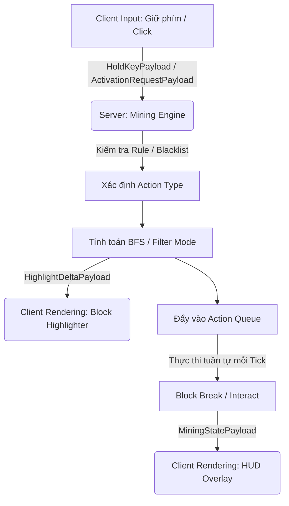

# TC-VeinGlow ✨

[](https://minecraft.net/)
[]()
[](https://opensource.org/licenses/MIT)

**TC-VeinGlow** là một mod Vein Mining tiên tiến và cực kỳ linh hoạt dành cho Minecraft 1.21.1, hỗ trợ đa nền tảng (Multiloader: **Fabric**, **Forge**, và **NeoForge**). Được phát triển bởi ToanCao, TC-VeinGlow vượt xa các mod đào quặng truyền thống bằng cách cung cấp một hệ thống Engine mạnh mẽ, giao diện đồ họa (GUI) phong phú, và vô số kỹ năng (Skills) mở rộng để tự động hoá việc thu hoạch, xây dựng và tương tác trong thế giới Minecraft.

---

## 🌟 Tính Năng Nổi Bật

- **⛏️ Smart Vein Mining:** Khai thác toàn bộ mạch quặng hoặc chuỗi khối liên kết chỉ trong một thao tác. Hỗ trợ hệ thống Hàng đợi Khối (Block Action Queue) mượt mà để tránh giật lag server.
- **📐 Đa Dạng Hình Dạng Đào (Mining Shapes):**
  - Cơ bản: `FACE` (kề mặt), `EDGES` (kề cạnh), `CORNERS` (kề góc).
  - Nâng cao: `TUNNEL_1x2`, `TUNNEL_3x3` (Đào hầm), `STAIR_UP`, `STAIR_DOWN` (Đào cầu thang), `AREA_3x3`, `AREA_5x5` (Đào theo vùng).
  - Đặc biệt: `TREE_CAP` (Chặt toàn bộ cây và tự động trồng lại mầm cây).
  - Tùy chỉnh: Hỗ trợ tạo hình dáng đào riêng thông qua **Biểu thức toán học (Custom Equation)**.
- **✨ Hệ Thống Kỹ Năng (Skills):**
  - *BreakSkill*: Đào khối tiêu chuẩn.
  - *BucketSkill*: Múc hoặc đổ chất lỏng (nước, lava) hàng loạt.
  - *CropHarvestSkill*: Thu hoạch mùa màng diện rộng và tự động trồng lại.
  - *InteractSkill*: Tương tác hàng loạt (bóc vỏ gỗ, cày đất, tạo đường mòn, v.v.).
- **🎯 Tương Tác Trực Quan:**
  - **Radial Menu**: Chọn nhanh hình dạng đào ngay trong quá trình chơi thông qua menu tròn (bấm phím G).
  - **Block Highlighter**: Hiển thị viền tô sáng mượt mà cho các khối sẽ bị tác động (hỗ trợ màu tùy chỉnh RGB, chế độ cầu vồng).
  - **HUD Overlay**: Bảng thông tin nhỏ gọn hiển thị trạng thái và tiến độ đào trên màn hình.
- **⚙️ Cấu Hình Độc Lập & Đồng Bộ Mạng:**
  - Config Server & Client riêng biệt. Đồng bộ cấu hình qua mạng (C2S/S2C payloads).
  - Giao diện cài đặt trực quan (In-game GUI) gồm nhiều tab: General, Color, Filter, Skills, Shapes, Dashboard.
- **💡 Tối Ưu Hóa & Độc Lập:** Tương thích với các mod tối ưu hoá hiệu năng (Sodium, Lithium, C2ME) nhờ tính năng Chunk Caching. Không bắt buộc phải có ModMenu hoặc Cloth Config để chạy.

---

## 📥 Yêu Cầu Hệ Thống

| Thành phần | Phiên bản |
| :--- | :--- |
| **Minecraft** | `1.21.1` |
| **Java** | `21` |
| **Fabric** | Loader `>= 0.15.11` \| Fabric API `0.102.0+1.21.1` |
| **NeoForge** | NeoForge `21.1.x` |
| **Forge** | Forge `51.0.x` |
| **Tùy chọn** | ModMenu (Dành riêng cho Fabric để mở UI Cài đặt từ Menu chính) |

---

## 🛠 Cấu Trúc Dự Án (Multiloader)

Dự án được xây dựng trên kiến trúc Architectury, cho phép chia sẻ tối đa mã nguồn giữa các mod loader:

```text
TC_VeinGlow_Java/
├── common/                          # Mã nguồn Core dùng chung (Engine, Network, Logic)
├── client/                          # Giao diện Client dùng chung (GUI, HUD, Highlight, Config)
├── fabric/                          # Nền tảng Fabric (Entrypoints, Event Hooks)
├── forge/                           # Nền tảng Forge (Event Bus, Registry)
└── neoforge/                        # Nền tảng NeoForge (Payloads, Events)
```

---

## 🏗 Kiến Trúc Hoạt Động

Dự án áp dụng mô hình Client-Server chặt chẽ nhằm chống gian lận và tối ưu hiệu suất mạng:



---

## 💻 Build Từ Source Code

Bạn có thể tự biên dịch mod từ mã nguồn bằng Gradle:

```bash
# 1. Clone kho lưu trữ
git clone https://github.com/ToanCao/TC_VeinGlow.git
cd TC_VeinGlow

# 2. Build dự án (yêu cầu JDK 21)
./gradlew build
```
*Các tệp `.jar` hoàn chỉnh cho Fabric, Forge và NeoForge sẽ được tạo ra tại thư mục `build/libs/`.*

---

## ⚙️ Hướng Dẫn Cấu Hình

### Server-side Config (Tác động tới gameplay)
- `maxBlocks`: Giới hạn số khối tối đa được xử lý trong một lần kích hoạt (Mặc định: `128`).
- `miningSpeed`: Tốc độ đào (số khối được xử lý mỗi tick) để chống giật server (Mặc định: `3`).
- `requireHarvestCapability`: Bắt buộc người chơi phải cầm đúng loại dụng cụ phù hợp với khối.
- `consumeDurability` / `consumeHunger`: Cho phép tiêu hao độ bền của dụng cụ và thanh thức ăn của người chơi tương đương với việc đào thủ công.
- `blacklistedBlocks`: Danh sách các khối bị cấm khai thác hàng loạt.

### Client-side Config (Tác động tới hình ảnh)
- Tùy chỉnh màu sắc viền (Outline Color), độ dày viền, hiệu ứng chuyển tiếp (Transition).
- Bật/tắt HUD, bật/tắt các module kỹ năng (Skills).
- Các cấu hình này có thể chỉnh sửa trực tiếp thông qua Giao diện cài đặt In-game.

---

## 📄 Giấy Phép (License)

Dự án này được phát hành dưới các điều khoản của **MIT License**. Bạn hoàn toàn tự do sử dụng, chỉnh sửa và phân phối lại mã nguồn. Chi tiết vui lòng xem tệp `LICENSE`.
